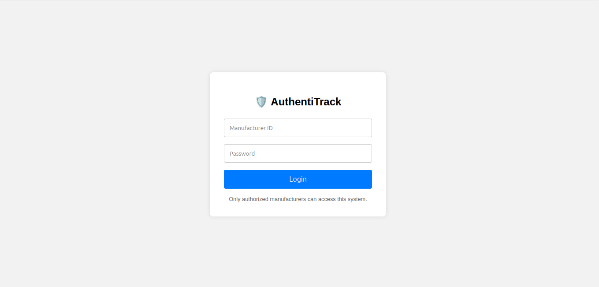
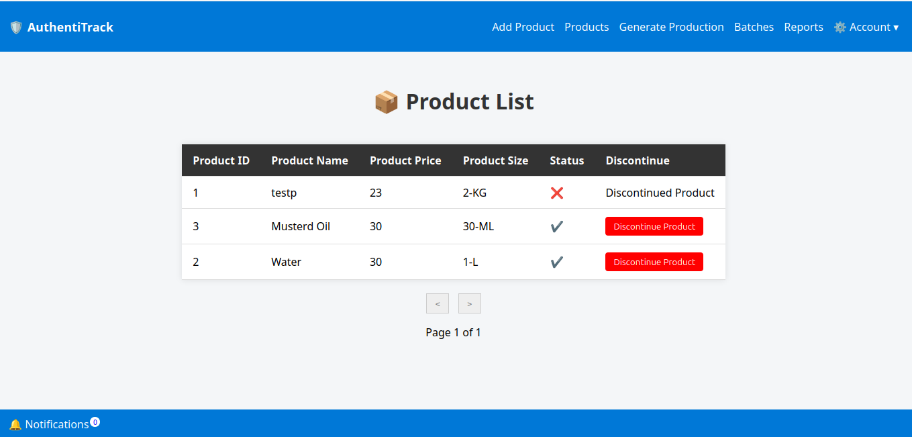
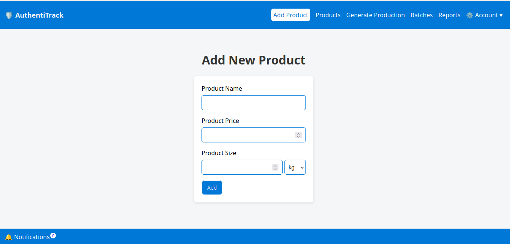
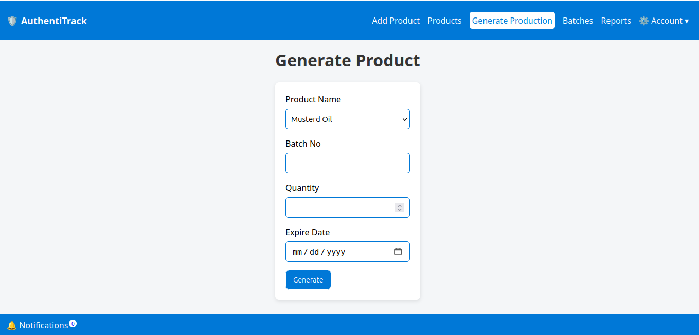
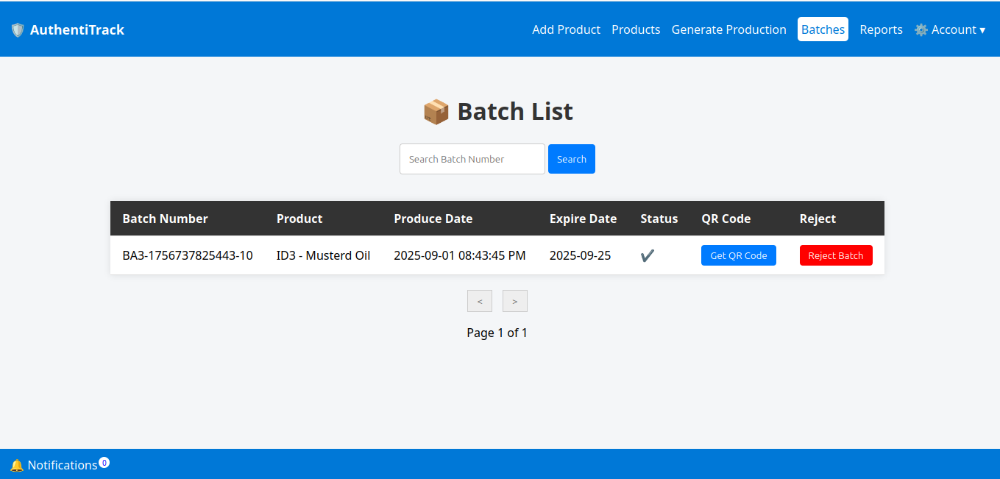
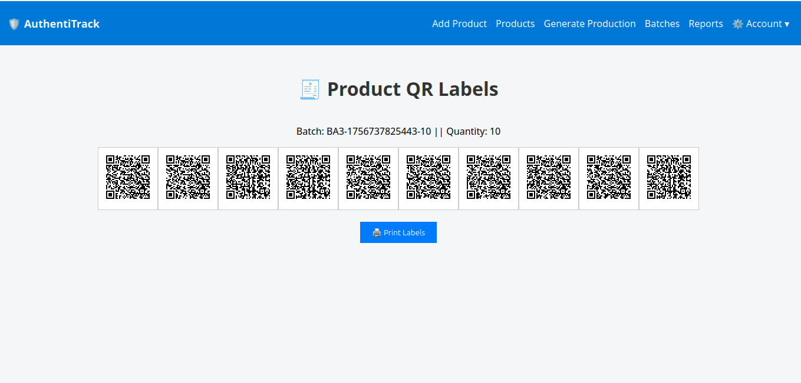
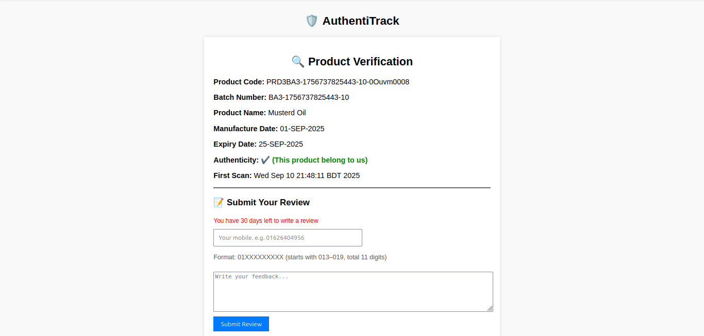
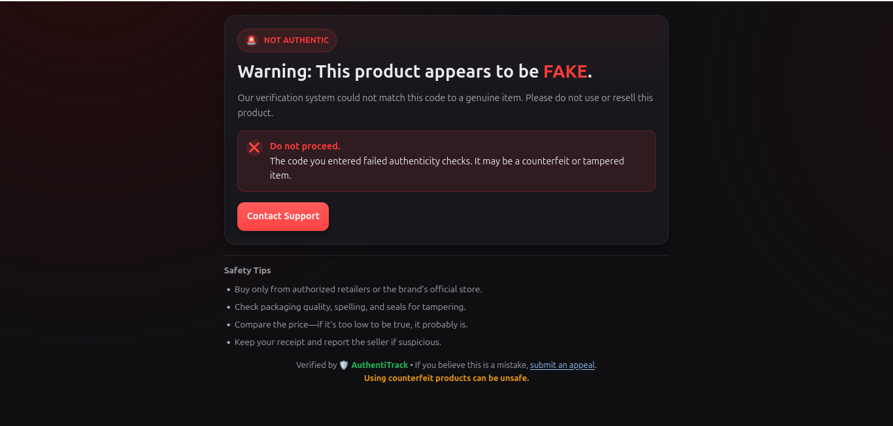

# 🏭 Product Authenticity Verification System (AuthentiTrack)

  
  
   

A **JavaEE + Oracle Database** based web application built exclusively for **manufacturing companies** to fight against **fake and cloned products**.  
The system generates **unique QR codes** for every product batch and provides customers with a secure way to verify authenticity, check product details, and submit feedback.  

---

## 🚀 Features  

- **Manufacturer Portal**  
  - Add products with details (name, description, expiry date, etc.)  
  - Generate **batches** with expiry date and other metadata  
  - Automatically generate **unique QR codes** for each product  
  - Monitor authenticity checks and feedback reports  
  - Mark unsafe batches as **inactive/recall from market**  

- **Customer Portal**  
  - Scratch & scan QR code to verify product authenticity  
  - View details: batch number, expiry date, authenticity status, scan history  
  - Detect if scanned before → prevents duplicate usage  
  - See if the batch is **active or recalled**  
  - Submit **feedback or complaint** (within 30 days of scan)  
  - Manufacturer can view and contact customer if necessary  

- **Security**  
  - Scratch-before-scan mechanism and watching scan history prevents duplicate QR scans  
  - Real-time verification against database  
  - Role-based access (Manufacturer, Customer)  

---

## 📂 Project Structure  

```

AuthentiTrack/
├── README.md
└── src
    └── main
        ├── java
        │   ├── controllers
        │   │   ├── AddProductController.java
        │   │   ├── ChangePassword.java
        │   │   ├── DiscontinueProduct.java
        │   │   ├── GenerateProduction.java
        │   │   ├── GetAllNotification.java
        │   │   ├── GetAllProduction.java
        │   │   ├── LoginController.java
        │   │   ├── RejectBatch.java
        │   │   └── SendReport.java
        │   ├── dao
        │   │   ├── BatchDao.java
        │   │   ├── NotificationDao.java
        │   │   ├── ProductDao.java
        │   │   ├── ProductionDao.java
        │   │   ├── UserReportDao.java
        │   │   └── UsersDao.java
        │   ├── entities
        │   │   ├── Batch.java
        │   │   ├── Notification.java
        │   │   ├── Produce.java
        │   │   ├── Product.java
        │   │   └── User.java
        │   └── helper
        │       ├── ConnectionProvider.java
        │       ├── LoginFilter.java
        │       ├── ScanDetailsPOJO.java
        │       └── UserReportPOJO.java
        └── webapp
            ├── fake.jsp
            ├── index.jsp
            ├── manufacturer
            │   ├── add_new_product.jsp
            │   ├── batches.jsp
            │   ├── footer.jsp
            │   ├── generate_product.jsp
            │   ├── logout.jsp
            │   ├── nav.jsp
            │   ├── products.jsp
            │   ├── qr_codes.jsp
            │   ├── show_report.jsp
            │   └── style.css
            ├── META-INF
            │   └── MANIFEST.MF
            ├── scan.jsp
            └── WEB-INF
                ├── lib
                └── web.xml


````

---

## ⚙️ Tech Stack  

- **Backend:** JavaEE (Servlets, JSP)  
- **Frontend:** JSP, CSS, JavaScript  
- **Database:** Oracle 21c DB  
- **QR Code:** qrious (JS library)  
- **Server:** Apache Tomcat  
- **IDE:** Eclipse Enterprise Edition  
- **Build:** WAR deployable  

---

## 🛠️ Setup & Installation  

### Prerequisites  
- Java 21 (Recommended)  
- Oracle Database (21c)  
- Apache Tomcat 10.1
- QR Code generation library (qrious)  

### Steps  

1. **Clone the repository**  
   ```bash
   git clone https://github.com/rahimuj570/AuthentiTrack
   cd AuthentiTrack


2. **Set up the Database (Oracle)**

   * Create a new schema `authenti_tracker`
   * Run the script from `source files/authenti_tracker.sql`

3. **Configure Database Connection**

   * Update your ConnectionProvider.java with Oracle DB credentials*

4. **Deploy the Application**

   * Build WAR file and deploy in Tomcat/GlassFish
   * Access the system at:

     ```
     http://localhost:8080/AuthentiTrack
     ```

---

## 📖 Usage

* **Manufacturer Workflow**

  1. Login as manufacturer
  2. Add product and create a new batch
  3. Generate QR codes (system auto-generates unique codes)
  4. Print and attach QR codes on product packaging
  5. Monitor customer scans and feedback

* **Customer Workflow**

  1. Scratch the QR sticker
  2. Scan the QR code → redirected to product verification page
  3. View product details (authenticity, expiry, batch status)
  4. If batch is recalled, warning message is displayed
  5. Optionally, submit feedback/complaint (valid for 30 days)

---

## 📸 Screenshots

### 🔐 Login Page



### 🧾 Product Details Page



### 🧾 Add Product Page



### ♻️ Generate Batch Page



### ♻️ Batch Details Page



### 🏷️ QR Codes Genrator Page



### 📱 QR Code Scan Result



### 📱 QR Code Scan Result (FAKE Product)



---

## 🔧 Development

* Use an IDE like Eclipse with Tomcat
* Configure **Oracle JDBC driver** in your server libraries
* For QR Code generation, include **qrious** in `qr_codes.jsp/`

---

## 🤝 Contribution

1. Fork the repo
2. Create a feature branch (`feature/my-new-feature`)
3. Commit changes (`git commit -m 'Add feature'`)
4. Push to branch
5. Open a Pull Request

---

